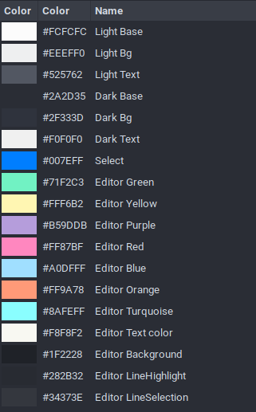

Set of clean and minimal visual improvements for Linux.

## Gnome

- Icons: [Plane icon theme](https://github.com/wfpaisa/plane-icon-theme).
- Theme: [Plane theme](https://github.com/wfpaisa/plane-theme)

## Apps theme and color schemes
- Sublime-theme: [Plane dark](https://github.com/wfpaisa/plane-sublime)
- Visual code: [Plane dark](https://github.com/wfpaisa/plane-vscode)
- Gedit: [Plane dark](https://github.com/wfpaisa/plane-gedit)
- Tilix: [Plane dark](https://github.com/wfpaisa/plane-terminal)
- Firefox: [Plane dark](https://addons.mozilla.org/en-US/firefox/addon/plane-dark/)
- Chrome: [Plane dark](https://github.com/wfpaisa/plane/tree/master/assets/chrome/)
- Atom: 
  - [Plane dark Atom Syntax](https://github.com/wfpaisa/plane-atom-syntax)
  - [Plane dark Atom UI](https://github.com/wfpaisa/plane-atom-ui)
- Typora: [Plane dark](https://github.com/wfpaisa/plane-typora).
- Blender: [Plane dark](https://github.com/wfpaisa/plane-blender)

## Colors
Download gpl color plalette `./Color palette.gpl`

|RGB Color|Color|
|--- |--- |
|238,239,240|Light Bg|
|82,87,98|Light Text|
|42,45,53|Dark Base|
|47,51,61|Dark Bg|
|240,240,240|Dark Text|
|0,126,255|Select|
|113,242,195|Editor Green|
|255,246,178|Editor Yellow|
|181,157,219|Editor Purple|
|255,135,191|Editor Red|
|160,223,255|Editor Blue|
|255,154,120|Editor Orange|
|138,254,255|Editor Turquoise|
|248,248,242|Editor Text color|
|31,34,40|Editor Background|
|40,43,50|Editor LineHighlight|
|52,55,62|Editor LineSelection|
